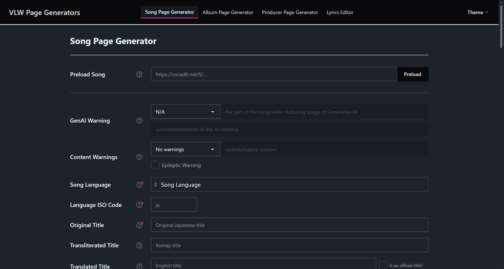

# Vocaloid Lyrics Wiki Page Generators

This is a set of forms used to create boilerplate pages on the Vocaloid Lyrics Wiki.



Forms:

- [Song page generator](https://ccxtwf.github.io/VLW-Page-Generator-v3/#/songs)
- [Album page generator](https://ccxtwf.github.io/VLW-Page-Generator-v3/#/albums)
- [Producer page generator](https://ccxtwf.github.io/VLW-Page-Generator-v3/#/producers)
- [Lyrics editor](https://ccxtwf.github.io/VLW-Page-Generator-v3/#/lyrics-editor)

## Getting Started for Development

### Overview

This application incorporates Svelte v5 with Tailwind CSS v4 and [DaisyUI](https://daisyui.com/) as the predominant component & UI library. [Handsontable](https://handsontable.com) is used as the library that renders spreadsheet-like components. [Vite Plus](https://viteplus.dev) is used as the integrated toolchain that handles runtime management, package management, linting, formatting, and testing in one go.

Besides the basic forms for data input, this application provides a feature for pre-loading data from VocaDB. Vocal synthesizers that are listed in VocaDB are automatically mapped to the corresponding category on the Vocaloid Lyrics Wiki when possible. For example, [VocaDB artist entry 60540](https://vocadb.net/Ar/60540) is mapped to the category `[[Category:Songs featuring Hatsune Miku (VOCALOID)]]` on Vocaloid Lyrics Wiki. The application attempts to map the VocaDB artist entry to the VLW category by checking the following:

- `src/constants/synths.json` for the most commonly used synths
- `public/synths.db` for a larger selection

### Pre-requisites

This application requires Node 24 and an installation of [Vite Plus](https://viteplus.dev/guide/) to run.

### Installation

Clone the repo using the following command:

```sh
git clone -b development git@github.com:ccxtwf/VLW-Page-Generator-v3.git
```

Install dependencies using the following command:

```sh
vp install    # equivalent to npm install, pnpm install, etc.
```

You then run the following command to apply package patches:

```sh
# Apply all patches in the directory `patches/`
# This command is only ran once after running `vp install`
git apply --ignore-space-change --ignore-whitespace --directory=node_modules/ patches/*.patch

# To apply a specific patch only, run the following command
# git apply --ignore-space-change --ignore-whitespace --directory=node_modules/ patches/FILENAME.patch
```

### Configuration

Hard-coded configuration values are specified in the filename `/src/config.ts`. **You most likely do not need to change these configuration values.**

Besides these values, this application also takes from the following environment variables:

```sh
# Used to set referrer when making web requests
VITE_REFER_FROM_ORIGIN=

# Build metadata
VITE_GITHUB_REPO_LINK=
VITE_GITLAB_REPO_LINK=
VITE_BUILD_CODE=
VITE_BUILD_DATE=
```

You can configure these variables by making a `.env` file after the example given in `.env.EXAMPLE`.

### Commands

Several commands are provided:

- `vp dev`: Starts up the application for development.
- `vp check`: Does formatting & linting checks on the source files without making any changes.
- `vp check --fix`: Make formatting changes & linting fixes where applicable.
- `vp test`: Runs unit tests.
- `vp build`: Builds the application for production and outputs to the `dist/` folder.
- `vp preview`: Starts up the application that was built using `vp build`.

### Testing

Unit tests are provided in the directory `__tests__/` to verify correctness. These unit tests may be run using the command `vp test`. The file `vitest.config.ts` defines how these tests will be run.

Integration tests given in the directory `__tests__/browsertests/` may be conducted & automated using [Playwright](https://playwright.dev). It is recommended to use a tool like [Playwright's VS Code extension](https://playwright.dev/docs/getting-started-vscode) to start running these tests. If you'd rather run via CLI, run `vpx playwright test`.

### Maintenance scripts

Several scripts (Python) are provided to maintain the datapoints used in this repository. To get started using these scripts, navigate to the `maintenance/` directory and run `uv sync` (or its equivalent command in pip: `pip install .`). Next, create a `.env` file in the `maintenance/` directory with the following values:

```sh
VOCADB_ARTIST_API_ENTRYPOINT=https://vocadb.net/api/artists
VOCALOID_LYRICS_WIKI_API_ENTRYPOINT=https://vocaloidlyrics.miraheze.org/w/api.php

# these are required to make requests to the live wiki
# check the [[mw:Manual:Bot passwords]] to see how to get these
BOT_USERNAME=<IDENTIFIER>@<IDENTIFIER>
BOT_PASSWORD=<BOT PASSWORD>
BOT_UA=*************
```

#### Check for new synths that may be added on VocaDB

To check the vocal synths that were recently added to VocaDB and were not yet added in `public/synths.db`, run the following command:

```sh
# this is equivalent to `uv run --project maintenance/ maintenance/missing-vdb.py Vocaloid,SynthesizerV,CeVIO,NewType,VoiSona`
vp run vdb-check

# to check against a specific vocal synth engine, run the following:
# e.g. uv run --project maintenance/ maintenance/missing-vdb.py UTAU
```

#### Maintaining synths.db

To check for any records in `public/synths.db` that may be incorrectly inputted:

```sh
# this is equivalent to `uv run --project maintenance/ maintenance/check.py db`
vp run db-check
```

To check for any records in `public/synths.db` that may be misaligned with the live Vocaloid Lyrics Wiki:

```sh
# this is equivalent to `uv run --project maintenance/ maintenance/check.py vlw`
vp run vlw-check
```

#### Preparing constants

To prepare the constants file `src/constants/synthEngines.json` to be used in the application:

```sh
# this is equivalent to `uv run --project maintenance/ maintenance/synths.py engines`
vp run prepEngines
```

To prepare the constants file `src/constants/synths.json` to be used in the application:

```sh
# this is equivalent to `uv run --project maintenance/ maintenance/synths.py synths`
vp run prepSynths
```
